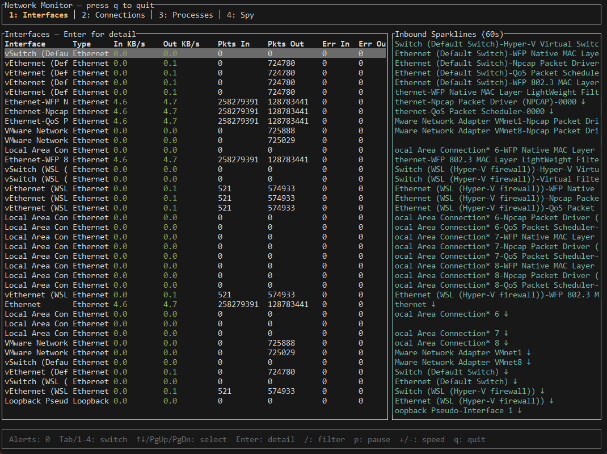

# Networkmonitor - Windows

## TUI based network monitor
This is a small network monitor tool like the ones can be found in Linux
made specifically to work within msys64 and Windows, Using Windows API primarily
it has no ncap capability but allows for monitoring traffic in and out of specific
processes, like bandwidth sppikes and such.

It is made to be a analysis tool.

Purely written in rust.

!(image2.png)

!(image3.png)

!(image4.png)

!(image5.png)

MIT
